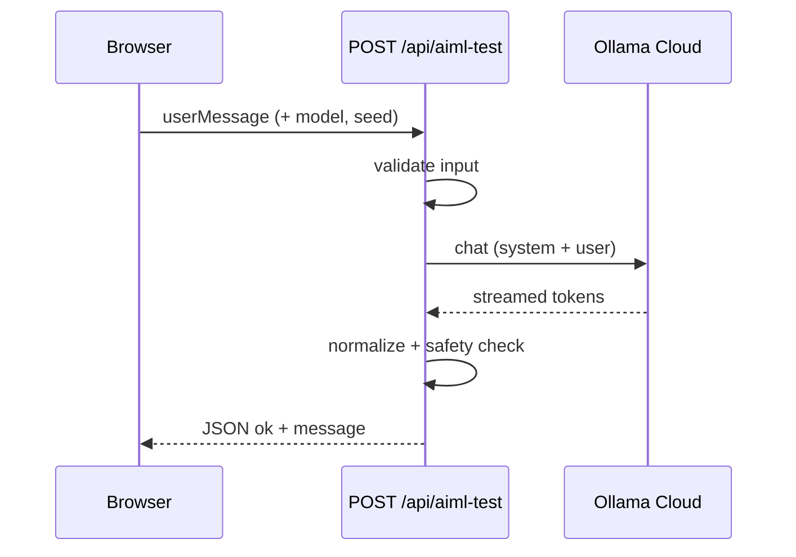

# SFS — Support For Support

**SFS** is a small Next.js app for support folks: paste a rough or heated draft reply, and get a calmer, professional version you can paste into tickets or chat. The UI leans playful (“rage → grace”), but the backend is a guarded rewrite: only support-style drafts are sent to the model.

## What it does

- **Rewrite tool** — You type your “spicy” draft; the app calls a hosted LLM (Ollama Cloud) with a fixed support-rewrite system prompt and returns a normalized reply.
- **Landing experience** — Hero, step hints, a **Rage → Grace** demo section, and light marketing copy on the home page (`app/page.tsx`).

The live rewrite is implemented in `components/sfs-rewriter-tool.tsx` and `app/api/aiml-test/route.ts`.

## Flow

1. Open the app in the browser (local dev: `http://localhost:3000`).
2. Enter your draft in **Your draft (the spicy version)**.
3. Click **Make It Nice™**. The client `POST`s to `/api/aiml-test` with `userMessage`, plus default `model` and `seed` from `lib/ollama-defaults.ts`.
4. The API route checks `OLLAMA_API_KEY`, validates the text (`lib/rewrite-input-guard.ts`), then chats with Ollama Cloud using `lib/support-rewrite-system-prompt.ts`, aggregates the streamed response, and normalizes output (`lib/normalize-rewrite-output.ts`).
5. If the response looks like a refusal for non-support content, the API returns an error instead of the text.
6. **The HR-approved version** appears; use **Copy** to grab it.



## Setup

### Prerequisites

- **Node.js** (version compatible with Next.js 16 in this repo)
- **Yarn** — this repo pins Yarn 4 via `packageManager` in `package.json`

### Install

```bash
yarn install
```

### Environment

Copy `.env.example` to `.env` and set at least:

| Variable           | Purpose                                      |
| ------------------ | -------------------------------------------- |
| `OLLAMA_API_KEY`   | **Required** for rewrites. API key for [Ollama](https://ollama.com) (Cloud). Without it, `/api/aiml-test` returns a 500 with a clear error. |

Other keys in `.env.example` are reserved for future features and are not required for the rewriter alone.

### Run locally

```bash
yarn dev
```

Open [http://localhost:3000](http://localhost:3000).

### Production

```bash
yarn build
yarn start
```

Ensure `OLLAMA_API_KEY` is set in the deployment environment.

## Stack (high level)

- **Next.js** (App Router), **React**, **TypeScript**, **Tailwind CSS**
- **Ollama** npm client → `https://ollama.com` with Bearer auth
- UI pieces under `components/` (including `components/ui/`)

## Scripts

| Command       | Description        |
| ------------- | ------------------ |
| `yarn dev`    | Development server |
| `yarn build`  | Production build   |
| `yarn start`  | Start production   |
| `yarn lint`   | ESLint             |
